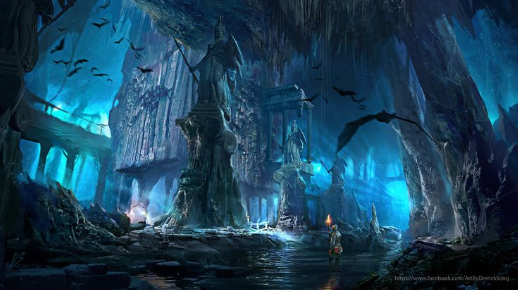
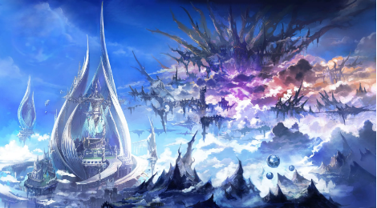
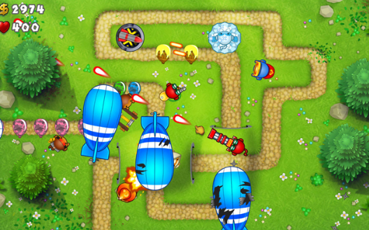
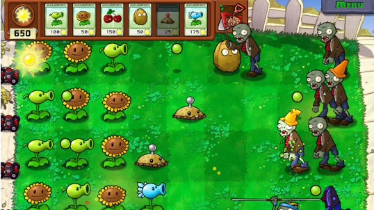
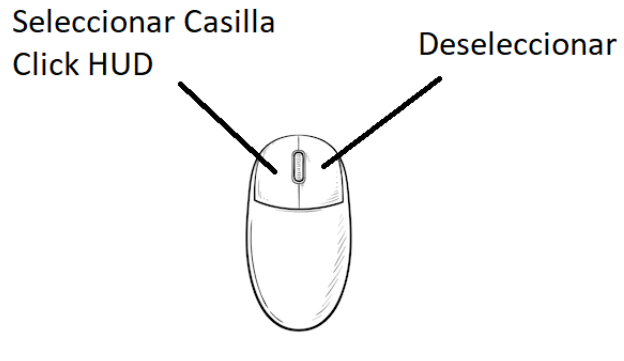
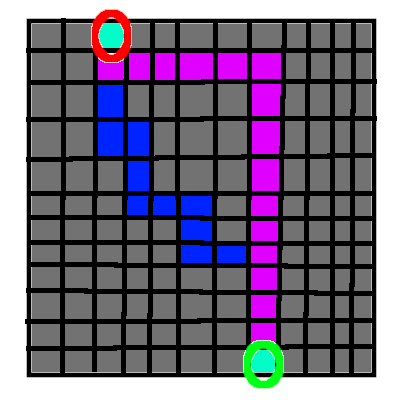
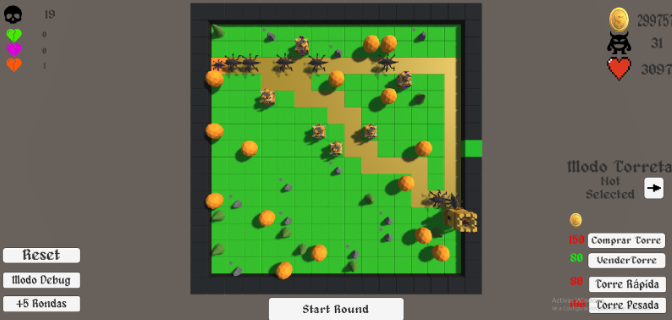

Enlace vídeo: https://www.youtube.com/watch?v=gNp88ykrl_g

# Introducción

“*En el mundo mágico de Vindegard, donde reinaba la paz y la armonía, apareció el diablo Pepadum, un ser despreciable y vil, descrito en el grimorio de la Paz. Según contaba la leyenda, esparcía la maldad en el mundo mediante la invocación de sus siervos, eliminando todo tipo de subsistencia, intentando aumentar de esta forma su ejército, ya que si la gente moría por su mano, absorbería su alma y la manejaría a su antojo.*

*Pero la civilización de Vindegard conocía desde hace mucho tiempo esta leyenda y ha estado preparándose para su vuelta. Ha estado mejorando sus defensas y creando nuevas armas con las que hacer frente a los diferentes siervos de Pepadum, intentando que este cese sus invocaciones y conviva con la civilización de manera pacífica. [...]”.*

Nuestra historia cuenta cómo la civilización de Vindegard se defendía de los ataques de Pepadum, el mismísimo Dios de la Muerte, mediante el uso de torres que atacaban con más o menos fuerza a los súbditos del Dios. Todos los intentos de defensa estaban controlados por el General Lolio, con una experiencia formidable en el campo de batalla. 

Pepadum a medida que morían sus súbditos iba generando más y más, cada vez eran más fuertes, por lo que tenían que mejorar sus torres de tal forma que pudieran eliminar a todos sus enemigos y logren hacer que el Dios de la Muerte levante la bandera blanca.

# Propuesta Proyecto Final

Nuestro proyecto final consiste en crear una inteligencia artificial basada en esta historia relatada, aplicándola así en un videojuego del género de Tower Defense. El proyecto va a ser un Tower Defense al estilo Bloons TD, con una generación aleatoria del mundo en cada partida que se comience, con una serie de torres aliadas que el usuario podrá colocar en unos lugares correspondientes, cada una con sus respectivas características, stats y daño, que se encargarán de defenderse de enemigos, que tendrán también sus características propias. El objetivo de estos será llegar al final del camino y el nuestro será eliminar a todos los enemigos, antes de que lleguen al final y logren ganar. Al ser tres integrantes en este proyecto, vamos a diferenciar claramente el trabajo de cada uno:

- David Rodríguez Gómez: Encargado de hacer una generación de mundo aleatoria. Para ello se va a disponer el escenario en casillas, y cada una será guardada en un array de dos dimensiones.El mapa va a tener un tamaño fijo de casillas, pero en cada run del juego puede haber más o menos casillas transitables, con la posibilidad de poder colocar más torres o menos. Al principio habrá únicamente un camino de entrada a salida (como idea hacer más de un camino posible, para que la IA de los enemigos pueda demostrar más su capacidad). A su vez, cada casilla tendría un valor correspondiente de paso, para que la IA de los enemigos pueda elegir el camino más rápido.
- Manuel Adeliño Consuegra: se encargará de la lógica de las torres, ya que cada torre podrá tener distintos comportamientos, el primero de ellos será atacar al enemigo que esté más cercano a la salida, el segundo será atacar al enemigo más fuerte que se encuentre en su zona y el último comportamiento sería atacar al enemigo que esté más lejos de la salida. En principio habrá un tipo de torre que será polivalente:
  - Arquero: dispara un proyectil físico, es decir, no es hit scan, en una dirección que puede atravesar un número determinado de enemigos.
- Alejandro Ortega Ruiz: Encargado de la generación de enemigos, sus distintos tipos, sus distintas stats (velocidad, vida), su movimiento a través del mapa generado, e ia de enemigos (camino más corto “1 camino”, y camino con menos torres “2 o más caminos”).

Creemos que la ambición es adecuada, es decir, pensamos que el contenido propuesto es bastante alcanzable, a la vez que añadimos cosas nuevas. Además, si llevamos un buen ritmo tenemos pensado añadir las siguientes ampliaciones:

- David: Generación de más de un camino posible para que los enemigos puedan transitar.
- Manuel: Añadir distintos tipos de torre:
  - Torre bombardero: ataque lento, con daño en área de efecto del proyectil pequeña y que hace mucho daño. El proyectil será hitscan, es decir seleccionará un enemigo de los posibles y se le hará el daño directamente. Si hay enemigos al lado de ese seleccionado  y en el área de impacto se les aplicará daño pero reducido.
  - Torre de pulsos:  Ataque en área pero que afecta a todo su radio de acción. Al atacar (crear un pulso) hace daño sobre todo el radio que tiene alrededor. Daño reducido ya que puede atacar a muchos enemigos a la vez
- Alejandro: En caso de que el mapa genere más de 1 camino para alcanzar la meta, que los enemigos tengan en cuenta ambos caminos y a su vez la disposición de las torretas de manera que elijan el camino más eficiente para llegar a la meta.

# ¿Cuál es el punto de partida?

Nuestro proyecto utilizará assets de terceras personas (modelos 3D, sonidos, ambientes, etc.), para intentar mostrar de manera fiel la historia contada previamente.No obstante, todo lo relacionado al funcionamiento e implementación de la inteligencia artificial estará realizada por nosotros mismos, evitando usar recursos de terceras personas.

# ¿Cómo lo vamos a hacer?

Aunque aún no hemos concretado cómo van a ser las especificaciones, pensamos que serán de la siguiente manera:

- David Rodríguez Gómez: Para la realización de la generación autónoma y aleatoria del terreno, aplicaremos un algoritmo que genera un camino a partir de un , dado en el tema 1 de la asignatura Inteligencia Artificial para Videojuegos. Antes de la generación de enemigos y/o torretas, se realizarán todo tipo de pruebas relacionadas con la generación del mundo. No obstante, para no entorpecer el trabajo de mis compañeros, realizaré una escena sin generación aleatoria para que puedan realizar sus pruebas y podamos realizar nuestro trabajo a la par.
- Manuel Adeliño Consuegra: Las torres, al tener diferentes modos de ataque, tendrán distintos comportamientos. Estará comprobando en cada iteración que enemigos están dentro de su radio, y si su modo es ataque al primero o al último accederá a una variable de los enemigos que contendrá la distancia hasta la meta siguiendo el camino, sin embargo, si su modo es atacar al más fuerte, comparará a los tipos de enemigos y en caso de empate atacará al que más vida tenga. En cuanto al proyectil, al ser físico, se instanciará un prefab flecha que atravesará a un determinado número de enemigos y que desaparecerá al quedarse sin resistencia(atravesar al máximo posible) o recorrer una distancia predeterminada.
- Alejandro Ortega Ruiz: Para la generación de enemigos, tendré unos enemigos con distintas stats guardadas, de manera que según las rondas vayan avanzando estos enemigos irán siendo más complicados y en mayor cantidad, mediante el algoritmo de A\* se realizará una búsqueda del camino óptimo para que los enemigos sepan porque camino es más probable llegar al final.

# Controles

# Solución

David Rodríguez Gómez:

**A-Generación escenario: Realizar la generación de un mapa de tamaño configurable.**

Para la generación de mapa, en el inicio del script *GeneracionMapa,* se realiza un bucle doble, creando una matriz de un tamaño determinado (siempre *MxM,* es decir, mapa SIEMPRE con forma cuadricular). Posteriormente, se ponen cuadrículas como borde del mapa.

**B-Colocación de obstáculos: Generación de obstáculos que eviten poder colocar torres en esa casilla.**

Para la generación de obstáculos, posteriormente a la colocación de las casillas del mapa, existe una posibilidad de un 20% de que, entre 3 tipos de obstáculos (roca, árbol1 y árbol2), coloque uno de estos en una casilla, evitando así la posterior colocación de una torre de defensa. Así, se permite al juego tener una mayor jugabilidad.

**C-Generación de un primer camino primario.**

El algoritmo de generación de un camino se realiza en el mismo script. Consiste en que en primer lugar, elige de manera aleatoria entre la parte superior del mapa o la parte izquierda del mapa para elegir el punto de inicio del que parten los enemigos, por lo que cuando se elija este punto, el punto donde deben llegar los enemigos será en el lado contrario. Cuando se elija desde qué lado se empieza, se elegirá una casilla aleatoria de un lado y del otro.

Entonces el algoritmo consiste en que primero girará a la izquierda o a la derecha, dependiendo de donde esté el fin de camino. Cuando se esté en el mismo nivel que la salida, se dibuja un camino de subida o de bajada, dependiendo si la salida está en la parte superior o inferior.

**D-Camino que fuera transitable por los enemigos.**

En un inicio, para que los enemigos pudieran transitar por el camino, mi compañero Alejandro iba a realizar el recorrido de los enemigos mediante waypoints, necesitaba que de alguna manera se pudieran guardar las casillas correspondientes a los cambios de dirección. Por lo que, a medida que se generaba el camino, cuando se detectaba que había un cambio de dirección, guardaba esa casilla en una nueva lista, para que a mi compañero Alejandro le sirvieran esas casillas como Waypoints. Pero se decidió realizar el recorrido de los enemigos mediante un grid, por lo que no se utilizan Waypoints, aunque quede constancia de que se realizó este apartado.

**E-Generación de un camino secundario.**

Para que el juego tuviera algo más de dificultad y diversión, se genera otro camino aleatorio, que no es el mejor posible, es decir, tiene más curvas y se puede entrelazar con el camino inicial. Para realizarlo, sigue la misma lógica que realizar un camino básico, solo que con la disponibilidad de elegir de forma aleatoria, cualquiera de las direcciones disponibles, evitando salirse del mapa y confluyendo con el camino inicial.

**Opcional.**

Tras tratar la Inteligencia artificial, también he realizado toda la búsqueda de assets, todos gratuitos y disponibles en la Unity Asset Store. También junto a mi compañero Manuel, realizamos todo el HUD, que estará explicado más adelante.

Alejandro Ortega Ruiz:

**A - Generación oleadas**

Para la generación de oleadas he utilizado el script “Spawner”.

- Spawner: encargado de generar enemigos. Dependiendo de la ronda en la que estemos, la cantidad de enemigos será mayor, el número de ronda en la que nos encontremos, será la cantidad de enemigos generados en la oleada. Las oleadas se generan cuando no queden enemigos por generar, ni enemigos por eliminar. Los distintos tipos de enemigos tienen las mismas posibilidades de generarse.

**B - Objetivo**

Para el objetivo de los enemigos tenemos un prefab “ExitPrefab”, este prefab es una casilla que se sitúa al final del recorrido, al llegar los enemigos a dicha casilla los enemigos se destruyen, para detectar la llegada de enemigos se hizo un metodo “OnTriggerEnter” en el script “EnemyMovement” que más tarde cambió mi compañero Manuel al script “Exit”.

También tenemos un prefab Castillo el cual se coloca encima de la casilla de salida, para indicar así el objetivo de los enemigos.

**C - Tipos Enemigos**

Para los Enemigos utilizamos 2 scripts “EnemyMovement” y “Enemy”, de este último se encargó mi compañero Manuel.

- EnemyMovement: con este script los enemigos son capaces de seguir el camino generado por el algoritmo A\* que explicaré más adelante, en el método “ActualizarCaminoSalida” actualizamos el camino que deben seguir los enemigos para llegar al objetivo y mediante el método “SeguirHilo” los enemigos modificarán sus posiciones conforme al camino generado por el algoritmo A\*, comprobando sus movimientos casilla a casilla.

**C1 - Enemigo Normal**

Tenemos un prefab llamado EnemigoNormal el cual es utilizado por el “Spawner” para instanciar dichos enemigos. Estos enemigos tienen 2 Vidas y 2 de Velocidad Máxima.

Este enemigo puede aparecer en cualquier ronda.

**C2 - Enemigo Rápido**

Tenemos un prefab llamado EnemigoRapido el cual es utilizado por el “Spawner” para instanciar dichos enemigos. Estos enemigos tienen 1 Vidas y 3 de Velocidad Máxima.

Estos enemigos pueden aparecer a partir de la ronda 2.

**C3 - Enemigo Fuerte**

Tenemos un prefab llamado EnemigoFuerte el cual es utilizado por el “Spawner” para instanciar dichos enemigos. Estos enemigos tienen 12 Vidas y 1 de Velocidad Máxima.

Estos enemigos pueden aparecer a partir de la ronda 2.

**D - Movimiento**

Para el movimiento utilizamos los script “Graph”, “Vertex”, “Edge”, “BinaryHeap”, “GeneracionMapa” y “EnemyMovement”.

- Vertex: Vértice del Grid, contiene una id, una lista de Vecinos y un vértice previo.
- Edge: conexión entre Vertex, guarda el coste de cada conexión entre Vértices.
- BinaryHeap: Montículo binario utilizado para guardar las aristas en orden de prioridad.
- Graph: en esta clase construimos un grafo utilizando los scripts mencionados anteriormente, en el método “GetPathAstar”, buscamos el camino óptimo entre dos vértices (Spawner, Objetivo), también tenemos en cuenta las torretas dispuestas en el mapa, ya que, estas afectarán al cálculo del camino óptimo para los enemigos. Recorremos una priorityQueue de aristas (BinaryHeap), de esta manera comprobamos los caminos y sus distintos costes, para ello recorremos la lista de torres, para que en el caso de que en el camino haya influencia de torres, el coste de dicho camino aumente. Dicho todo esto, el método GetPathAstar es capaz de obtener el camino óptimo teniendo en cuenta las torretas enemigas.
- GeneracionMapa: retoque el código de mi compañero David, en el cual generaba un mapa aleatorio de manera que el mapa aleatorio, hice que dicha clase heredase de “Graph” y a su vez, que al generarse el mapa aleatoriamente el grafo se fuese construyendo concorde a la generación.

Al principio, teníamos pensado que hubiese dos camino como una posible ampliación de manera que al comienzo sólo había un camino, para este caso utilicé movimiento por waypoints, los cuales se generaban en las esquinas, las cuales obtenía gracias a un método de mi compañero David, estos waypoints se guardaban en una lista y los enemigos recorren dichos waypoints. Todo esto se encuentra comentado en la parte inferior del script “EnemyMovement”.

Manuel Adeliño Consuegra:

**A - HUD**

Lo explicaremos más abajo.

**B - Gestión de enemigos**

Para la gestión de las torres he creado distintos scripts:

- Selectable: Permite seleccionar una casilla para poder poner, quitar y hacer referencia  a torretas. Se usa un raycast desde el punto de la cámara para saber a que GameObject apunta el cursor.
- GameManager: Además de todas las variables que permiten realizar el bucle de juego, tiene una variable para hacer referencia a la casilla seleccionada.
- TowerManagement: Tiene métodos que permiten crear, destruir, mejorar y cambiar el comportamiento de las torres.

**C - Comportamiento de torres**

Al igual que la gestión de enemigos, se utilizan varios scripts:

- Tower: Se encarga de disparar, en este script se encuentra mayor parte de la IA de las torres. Su propósito es seleccionar el enemigo óptimo dependiendo del comportamiento definido. Además, posee el algoritmo de predicción del movimiento de los enemigos y el algoritmo para el cálculo del vector velocidad del proyectil, este último también dependiendo del comportamiento que esté usando la torre. Por último, guarda los enemigos que estén dentro de su rango.
- Proyectil: Controla las colisiones y el daño de los proyectiles.
- Enemigo: permite identificar el tipo de enemigo y controlar su vida.
- DrawRadius: Dibuja de forma visual el radio de Tower.

**Trabajo extra**

- Exit: Refactorización de la comprobación del método OnCollisionEnter del EnemyMovement de Alejandro.

**Ampliaciones**

Aunque no he seguido las ampliaciones al pie de la letra, ya que antes quería hacer una torre bombardero y otra torre de pulsos, lo que he hecho es ampliar la torre básica ya que era muy simple. En vez de la bombardero, hay un comportamiento en la nueva torre que es disparar proyectiles pesados y que permiten elegir a los fuerte para hacerles focus, de la misma manera, al no haber hordas de un mismo enemigo, sino que hay más variedad, hacía falta una nueva torre que se encargará de los enemigos veloces, por lo que creé la mejora de la torre que dispara proyectiles más rápidos, que junto con el comportamiento de atacar al primero puede hacer frente a estos enemigos.

Manuel Adeliño y David Rodríguez:

**A/B - HUD**

Utilizamos el script de UIManager junto con  métodos públicos de los demás scripts y del GameManager para llevar a cabo la siguiente interfaz, en la que se refleja los números de enemigos muertos, los que nos han atacado, el número de monedas, la oleada en la que nos encontramos, y la vida que tenemos, además de los botones correspondientes referidos al modo Debug, compra-venta de torres, el modo de la torreta y el inicio de la ronda:

# Bibliografía y/o referentes

- *Diapositivas del Curso 2021-2022 de la asignatura de Inteligencia Artificial del tercer curso del grado de Desarrollo de Videojuegos impartida por Federico Peinado Gil.*
- *AI for Games, Third Edition Ian Millington.*
- *Unity 2018 Artificial Intelligence Cookbook, Second Edition (**Repositorio**)* <https://github.com/PacktPublishing/Unity-2018-Artificial-Intelligence-Cookbook-Second-Edition>
- *Unity Artificial Intelligence Programming, Fourth Edition (**Repositorio**) <https://github.com/PacktPublishing/Unity-Artificial-Intelligence-Programming-Fourth-Edition>*
- *Opsive, Behavior Designer <https://opsive.com/assets/behavior-designer/>*
- *Unity, Bolt Visual Scripting <https://docs.unity3d.com/bolt/1.4/manual/index.html>*
- *Unity, Navegación y Búsqueda de caminos <https://docs.unity3d.com/es/2019.3/Manual/Navigation.html>*
- *Plants vs. Zombies [Compra Plants vs. Zombies – PC – EA*](https://www.ea.com/es-es/games/plants-vs-zombies/plants-vs-zombies)*
- *Bloons Tower Defense [Bloons Tower Defense - Wikipedia, la enciclopedia libre*](https://es.wikipedia.org/wiki/Bloons_Tower_Defense)*

